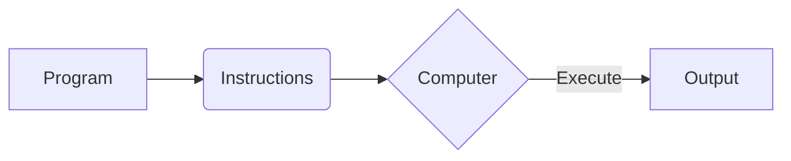
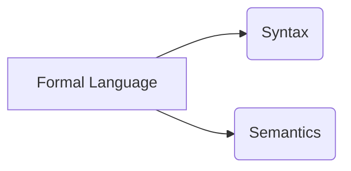
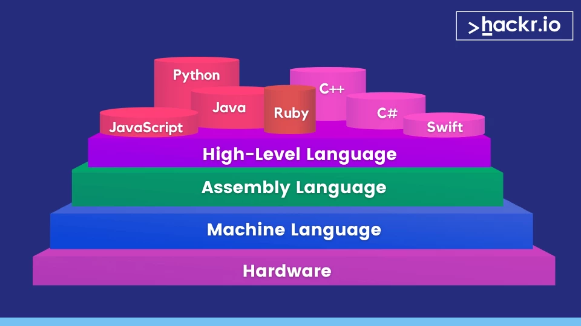

# Programming Logic form Zero to Hero

## Summary

Programming logic is essential for developing software applications and solving complex problems. By mastering the fundamental concepts of programming logic, you'll be better equipped to write efficient, maintainable, and scalable code.

## Learning Objectives

By the end of this section, you should be able to:

- Define and use variables to store and manipulate data.
- Identify and work with different data types.
- Apply arithmetic, comparison, and logical operators to perform operations on data.
- Use control structures like loops and conditionals to control the flow of a program.
- Create and call functions to encapsulate and reuse code.
- Implement error handling techniques to handle exceptions in a program.

## Prerequisites

- Desire to learn.
- Wanna have the power to create anything you want.

## Introduction

- **What is a program?**<br/>
A program is a set of instructions that tell a computer what to do. These instructions are written in a programming language, which is a formal language that can be understood and executed by a computer. Programs can perform a wide range of tasks, from simple calculations to complex data processing and analysis.



- **What is programming language?**<br/>
A programming language is a formal language that can be used to write instructions that can be executed by a computer. There are many different programming languages, each with its own syntax and semantics. Some popular programming languages include Python, Java, C++, and JavaScript.

```python
print("Hello, world!")
```

- **What is a formal language?**<br/>
A formal language is a language that is designed for a specific purpose and has a precise syntax and semantics. Formal languages are used in many different fields, including mathematics, logic, and computer science. Programming languages are a type of formal language that is used to write instructions that can be executed by a computer.



- **What is syntax and semantics?**<br/>
  - **Syntax**: The rules that define the structure of a language, including the order and arrangement of symbols and words. Syntax errors occur when the rules of a language are violated.
  - **Semantics**: The meaning of the symbols and words in a language. Semantics errors occur when the meaning of an instruction is unclear or ambiguous.

  ```python
  # Syntax error
  print("Hello, world!) # Missing closing quote

  # Semantics error
  func sum(a, b): # Missing return statement
      a - b
  
  # Correct code
  def sum(a, b):
      return a + b
  ```

- **Types of programming languages:**<br/>
  - **Low-level languages**: These languages are close to machine code and are specific to a particular type of computer architecture. Examples include assembly language and machine code.
  - **High-level languages**: These languages are closer to human language and are easier to read and write. Examples include Python, Java, and C++.

  

  ```python
  # Python
  a = 1
  b = 2
  c = a + b
  ```
  
  ```c++
  // C++
  int a = 1;
  int b = 2;
  int c = a + b;
  ```

  ```assembly
  ; Assembly language
  mov eax, 1
  mov ebx, 2
  add eax, ebx
  ```
  
  ```binary
  01010100 01101000 01101001 01110011 00100000 01101001 01110011 00100000 01100001 00100000 01110011 01110100 01110010 01101001 01101110 01100111
  ```

## Programming objectives

- **Efficiency**: Write code that is easy to read, understand, and maintain.
- **Scalability**: Design programs that can handle large amounts of data and complex operations.
- **Reusability**: Create code that can be reused in different parts of a program or in other programs.
- **Reliability**: Develop software that is robust and error-free, with proper error handling and testing.

## What is programming logic?

Programming logic is the process of creating a sequence of instructions to solve a problem. It involves breaking down a problem into smaller, more manageable parts and then designing a solution using programming constructs like loops, conditionals, and functions.

- **Properties of programming logic**:
  - **Sequential**: Instructions are executed in order, one after the other.
  - **Repetitive**: Loops are used to repeat a sequence of instructions multiple times.
  - **Conditional**: Conditionals are used to execute different instructions based on a condition.
  - **Modular**: Functions are used to encapsulate and reuse code in a program.

- **Problem-solving process**:
  1. **Understand the problem**: Identify the requirements and constraints of the problem.
  2. **Break down the problem**: Divide the problem into smaller, more manageable parts.
  3. **Design a solution**: Create a sequence of instructions to solve each part of the problem.
  4. **Implement the solution**: Write code that implements the instructions in a programming language.
  5. **Test the solution**: Verify that the code works correctly and produces the expected results.

- **Example**:
  - **Problem**: Calculate the sum of the first `n` natural numbers.
  - **Solution**:
    1. **Understand the problem**: Given a positive integer `n`, calculate the sum of the first `n` natural numbers.
    2. **Break down the problem**: Calculate the sum of the first `n` natural numbers using the formula `sum = n * (n + 1) / 2`.
    3. **Design a solution**: Write a function that takes an integer `n` as input and returns the sum of the first `n` natural numbers.
    4. **Implement the solution**:

    ```python
    def sum_of_natural_numbers(n):
        return n * (n + 1) // 2
    ```

    5. **Test the solution**:

    ```python
    print(sum_of_natural_numbers(10)) # Output: 55
    ```

- **Programming constructs**:
  - **Variables**: Containers for storing data that can be referenced and manipulated in a program.

    ```python
    x = 10
    y = 20
    z = x + y
    ```

  - **Data Types**: The different types of data that can be used in a program, such as integers, floats, strings, and booleans. [Data types](https://python-reference.readthedocs.io/en/latest/basic_data_types.html)

    ```python
    a = None # None
    b = 10 # Integer from 2147483648 through 2147483647
    c = 3.14 # Float from 2.2250738585072014e-308 through 1.7976931348623157e+308
    d = 1 + 2j # Complex from 0 through 2^64-1
    e = "Hello, world!" # String, Unicode, 8-bit
    f = True # Boolean (True or False)
    g = [1, 2, 3] # List (Array)
    h = {"name": "Alice", "age": 30} # Dictionary (Object)
    i = (1, 2, 3) # Tuple (Immutable list)
    j = {1, 2, 3} # Set (Unique elements)
    ```

  - **Operators**: Symbols that perform operations on data, such as arithmetic, comparison, and logical operations.

    ```python
    # Arithmetic operators returns a scalar result
    x = 10 + 5 # Addition
    y = 10 - 5 # Subtraction
    z = 10 * 5 # Multiplication
    w = 10 / 5 # Division
    v = 10 % 5 # Modulus
    u = 10 ** 5 # Exponentiation
    t = 10 // 5 # Floor division

    # Comparison operators returns a boolean result
    a = 10 == 5 # Equal to
    # a = 10 === 5 # Exaclty the same
    b = 10 != 5 # Not equal to
    # b = 10 !== 5 # Distinct to
    c = 10 > 5 # Greater than
    d = 10 < 5 # Less than
    e = 10 >= 5 # Greater than or equal to
    f = 10 <= 5 # Less than or equal to

    # Logical operators return a boolean result
    g = True and False # Logical AND
    h = True or False # Logical OR
    i = not True # Logical NOT
    ```

  - **Control Structures**: Constructs that control the flow of a program, such as loops and conditionals.

    ```python
    # Conditional statements validate boolean values
    if x > 0: # Continues when is true
        print("Positive")
    elif x < 0: # Continues when last validations was false and this validation is true
        print("Negative")
    else: # Goes when every single past validations was false
        print("Zero")

    # Loops iterates over every single item into an array
    for i in range(10):
        print(i)

    # Iterates when the condition is true
    while x < 10:
        print(x)
        x += 1
    ```

  - **Functions**: Blocks of reusable code that can be called with different arguments to perform specific tasks.
  
    ```python
    def greet(name):
        return f"Hello, {name}!"

    print(greet("Alice")) # Output: Hello, Alice!
      ```

  - **Error Handling**: Techniques for handling errors and exceptions that may occur during program execution.

    ```python
    try:
        x = 10 / 0
    except ZeroDivisionError as e:
        print("Error:", e)
    finally:
        print("Done")
    ```

By understanding these concepts, you'll be able to write more efficient and effective programs that can solve a wide range of problems.

## Pseudo code

Pseudo code is a high-level description of a computer program or algorithm that uses natural language and informal syntax to represent the logic of the program. It is used to plan and design a program before writing the actual code.

- **Advantages of pseudo code**:
  - **Simplicity**: Pseudo code is easy to read and understand, even for non-programmers.
  - **Flexibility**: Pseudo code is not tied to a specific programming language, so it can be used to plan programs in any language.
  - **Clarity**: Pseudo code helps to clarify the logic of a program and identify potential issues before writing the actual code.

- **Example**:
  - **Problem**: Calculate the sum of the first `n` natural numbers.
  - **Pseudo code**:

    ```pseudo
    function sum_of_natural_numbers(n)
        sum = 0
        for i = 1 to n
            sum = sum + i
        return sum
    ```

    ```pseudo
    /* 
      Bloque de codigo que me ayuda a sumar los numeros naturales empezando desde 0 hasta un numero limite
    */
    funcion suma_de_numeros_naturales(numero_limite)
      # empezamos desde 0 ya que si empezamos desde -1 en lugar de sumar restamos
      variable suma = 0

      # iteramos/recorremos/visitamos todos los numeros mayores a cero y menores e iguales al numero limite
      iteramos idx desde 1 hasta n
        # sumamos a la variable suma el valor que contiene + el numero visitado actualmente
        suma = suma + idx

      # retornamos la variable suma y regresamos el control del flujo al programa principal
      retornamos suma
    ```

  - **Implementation**:

    ```python
    def sum_of_natural_numbers(n):
        sum = 0
        for i in range(1, n + 1):
            sum += i
        return sum

    print(sum_of_natural_numbers(10)) # Output: 55
    ```

## Exercise 1

## Projects

- [Calculator](Calculator.md)
- [To-Do List](To-Do%20List.md)

## Resources

- [Fundamentos de programación](./resources/Fundamentos%20de%20Programación%20-%20Luis%20Joyanes%20Aguilar.pdf)

## Quiz

Test your knowledge of programming logic with this [quiz](Quiz.md).

## Exercises

- [ ] Quiero un pan con crema de avellanas y un café con leche.
- [ ] 
